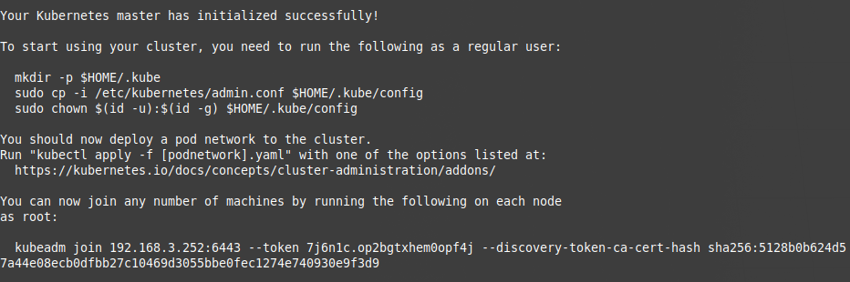
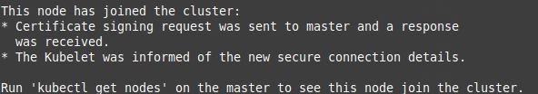
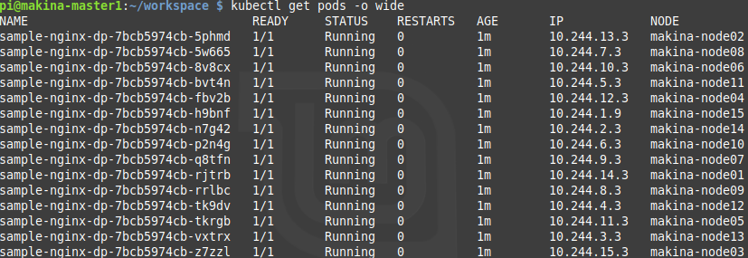
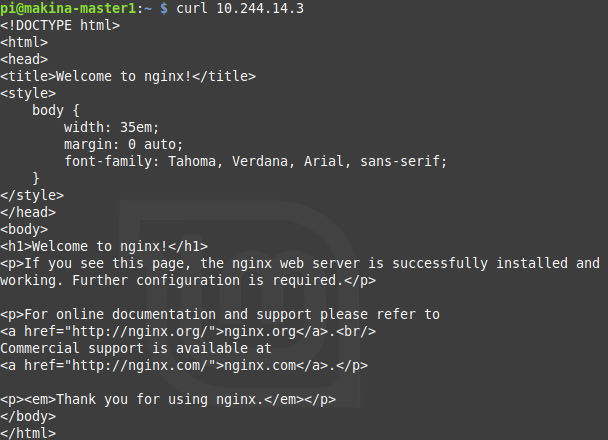

# ラズパイKubernetesシングルコントロールプレーンクラスターの構築

# 概要
このリポジトリはRaspberry PiでKubernetesクラスターを構築するための手順とスクリプトをまとめたものです。


# 要求
- マスターノード用Raspberry Pi：1台
- ワーカーノード用Raspberry Pi：1台以上
- Raspberry Piがクラスターとして稼働するための最低限の周辺機器で構成されており、初期設定済みであること
- SSHでpiユーザにログインできること


# サポート
## Raspberry Pi
- Raspberry Pi 3 Model B　　
  - [2017-09-07-raspbian-stretch.img](
https://downloads.raspberrypi.org/raspbian/images/raspbian-2017-09-08/2017-09-07-raspbian-stretch.zip)


- Raspberry Pi 4 Model B  
  - [2020-02-05-raspbian-buster.img](
https://downloads.raspberrypi.org/raspbian/images/raspbian-2020-02-07/2020-02-05-raspbian-buster.zip)


_**\* ワーカーノードを10台以上にする場合、マスターノードにRaspberry Pi 3を使用するとメモリが足りなくなり、Kubernetesがうまく動作しなくなる可能性があります**_  
_**10台以上のワーカーノードでクラスターを構築する場合にはマスターノードにRAMが2GBか4GBのRaspberry Pi 4を使用してください**_

_**\* マスターノードに2GB/4GB RAMのRaspberry Pi 4を使用した場合、現状(2020-03-27 JST)ではクラスターに参加できるワーカーノードの上限数は定かではありません**_  
_**なお、マスターノードがRaspberry Pi 4 RAM 4GBの場合、ワーカーノードが15台で構築されたクラスターの動作は確認しております**_


## Docker
- v18.06.3
- v19.03.8


## Kubernetes
- v1.10.5
- v1.13.5


# Kubernetesクラスターの構築方法

## オプション設定
下記の項目はオプションです。  
クラスター構築に対して直接関連していません。  
しかし、下記の設定を適用することでクラスターのパフォーマンスを上げることができます。

### GPUメモリ使用量の最小化
[ラズパイのGPUメモリの使用量を最小化させる](https://github.com/izewfktvy533zjmn/Build_RasPi_Kubernetes_Cluster/wiki/%E3%83%A9%E3%82%BA%E3%83%91%E3%82%A4%E3%81%AEGPU%E3%83%A1%E3%83%A2%E3%83%AA%E3%81%AE%E4%BD%BF%E7%94%A8%E9%87%8F%E3%82%92%E6%9C%80%E5%B0%8F%E5%8C%96%E3%81%95%E3%81%9B%E3%82%8B)を適用するとGPUメモリの使用量を最小化することができます。

### 内蔵Wi-FiとBluetoothの機能の無効化
[ラズパイの内蔵Wi-FiとBluetoothの機能を無効化する](https://github.com/izewfktvy533zjmn/Build_RasPi_K8s_Cluster/wiki/%E3%83%A9%E3%82%BA%E3%83%91%E3%82%A4%E3%81%AE%E5%86%85%E8%94%B5Wi-Fi%E3%81%A8Bluetooth%E3%81%AE%E6%A9%9F%E8%83%BD%E3%82%92%E7%84%A1%E5%8A%B9%E5%8C%96%E3%81%99%E3%82%8B)を適用すると
消費電力を抑えることができます。


## 共通設定
下記の項目はマスターノード、ワーカーノード、共通の設定です。

### cgroupsの有効化
[ラズパイ上でDockerを動作させるためにcgroupsを有効化する](https://github.com/izewfktvy533zjmn/Build_RasPi_Kubernetes_Cluster/wiki/%E3%83%A9%E3%82%BA%E3%83%91%E3%82%A4%E4%B8%8A%E3%81%A7Docker%E3%82%92%E5%8B%95%E4%BD%9C%E3%81%95%E3%81%9B%E3%82%8B%E3%81%9F%E3%82%81%E3%81%ABcgroups%E3%82%92%E6%9C%89%E5%8A%B9%E5%8C%96%E3%81%99%E3%82%8B)に従って、ラズパイ上でDockerを動作させるために必要な設定を行ってください。


### Dockerのインストール
- ### Raspberry Pi 3の場合
　　[Raspberry Pi 3上にDockerをインストールする](https://github.com/izewfktvy533zjmn/Build_RasPi_Kubernetes_Cluster/wiki/Raspberry-Pi-3%E4%B8%8A%E3%81%ABDocker%E3%82%92%E3%82%A4%E3%83%B3%E3%82%B9%E3%83%88%E3%83%BC%E3%83%AB%E3%81%99%E3%82%8B)に従って、Dockerの動作環境を構築してください。

- ### Raspberry Pi 4の場合
　　[Raspberry Pi 4上にDockerをインストールする](https://github.com/izewfktvy533zjmn/Build_RasPi_Kubernetes_Cluster/wiki/Raspberry-Pi-4%E4%B8%8A%E3%81%ABDocker%E3%82%92%E3%82%A4%E3%83%B3%E3%82%B9%E3%83%88%E3%83%BC%E3%83%AB%E3%81%99%E3%82%8B)に従って、Dockerの動作環境を構築してください。


### Kubernetesのインストール
　[Raspberry Pi上にKubernetesをインストールする](https://github.com/izewfktvy533zjmn/Build_RasPi_Kubernetes_Cluster/wiki/Raspberry-Pi%E4%B8%8A%E3%81%ABKubernetes%E3%82%92%E3%82%A4%E3%83%B3%E3%82%B9%E3%83%88%E3%83%BC%E3%83%AB%E3%81%99%E3%82%8B)に従って、Kubernetesの動作環境を構築してください。


## マスターノードの設定
_**\* 注意**_  
_**Kubernetes v1.13.5とDocker v18.06.3をインストールしたマスターノードに以下の設定を行ったところうまく動作しませんでした。**_  
_**Kubernetes v1.13.5をマスターノードで使用する場合には、Docker v19.03.8を使用することを推奨します。**_  
_**なお、この組み合わせの場合、うまく動作することを確認しております。**_  

DockerとKubernetesのインストールが完了したマスターノード上で下記のコマンドを実行し、クラスター構築の初期化を行います。  

```
sudo kubeadm init --pod-network-cidr=10.244.0.0/16 --apiserver-advertise-address=${MASTER_NODE_IP_ADDRESS} --kubernetes-version=${KUBERNETES_VERSION}　--ignore-preflight-errors=SystemVerification
```

マスターノードの初期化時に発行されるトークンの有効期限を無期限にするにはコマンドに _"--token-ttl=0"_ を追加して実行します。

```
sudo kubeadm init --pod-network-cidr=10.244.0.0/16 --apiserver-advertise-address=${MASTER_NODE_IP_ADDRESS} --kubernetes-version=${KUBERNETES_VERSION} --ignore-preflight-errors=SystemVerification --token-ttl=0
```

_**\* ${MASTER_NODE_IP_ADDRESS} にはご自身のマスターノードのIPアドレスを記載してください**_  
_**\* ${KUBERNETES_VERSION} にはインストールしたKubernetesnoバージョンを記載してください**_

以下は実行例です。

```
sudo kubeadm init --pod-network-cidr=10.244.0.0/16 --apiserver-advertise-address=192.168.3.251 --kubernetes-version=v1.13.5 --ignore-preflight-errors=SystemVerification --token-ttl=0
```

実行コマンドが成功すると以下のような結果が得られます。

<br>

上記の結果をもとに以下のコマンドを実行し、クラスター構築の初期化を完了させます。

```
mkdir -p $HOME/.kube*  
sudo cp -i /etc/kubernetes/admin.conf $HOME/.kube/config
sudo chown $(id -u):$(id -g) $HOME/.kube/config
```

最後に、以下のコマンドを実行し、初期化したクラスターに対してネットワークプラグインの適用を行います。

```
cd Build_RasPi_Kubernetes_Cluster
cd cni
kubectl apply -f ./kube-flannel_v0.9.1-arm.yaml
```

マスターノードの設定は以上です。


## ワーカーノードの設定
クラスター構築におけるマスターノードの初期化時に得られた結果をもとにワーカーノードをクラスターに参加させます。  

```
sudo kubeadm join ${MASTER_NODE_IP_ADDRESS}:6443 --token ${TOKEN} --discovery-token-ca-cert-hash ${DISCOVERY_TOKEN_CA_CERT_HASH_SHA256} --ignore-preflight-errors=SystemVerification
```

以下は実行例です。

```
sudo kubeadm join 192.168.3.251:6443 --token 7j6n1c.op2bgtxhem0opf4j --discovery-token-ca-cert-hash sha256:5128b0b624d57a44e08ecb0dfbb27c10469d3055bbe0fec1274e740930e9f3d9 --ignore-preflight-errors=SystemVerification
```

クラスターへの参加が成功すると以下のような結果が得られます。

<br>

ワーカーノードの設定は以上です。


# Kubernetesクラスターの動作検証方法
ここでは、[Kubernetesクラスターの構築方法](#Kubernetesクラスターの構築方法)に従って構築したクラスターの動作検証を行います。


## ワーカーノードにおける稼働状況の確認
マスターノードにて下記のコマンドを実行し、ワーカーノードがクラスター上で稼働しているか確認します。

```
kubectl get nodes -o wide
```

以下は実行例です。

<br>


## コンテナデプロイメントの検証
マスターノード上で以下のコマンドを実行し、ワーカーノード上でnginxのコンテナを起動させます。

```
cd Build_RasPi_Kubernetes_Cluster
cd sample
kubectl apply -f ./sample-nginx-dp.yaml
```

以下は実行例です。  
_**\* この実行例ではreplicas数を調整しています**_

<br>

上記の結果に記載されているIPアドレスに対してHTTPリクエストを送り、ワーカーノード上でnginxのサービスにが稼働しているか検証します。  
以下は実行例と実行結果です。

```
curl 10.244.14.3
```

<br>

上記のような結果が得られればKubernetesクラスターは正常に動作しています。
